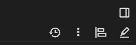

Lets you click a button to open the right pane again after closing it. Remembers the right pane state by label.

## Version: 0.1
## Installation
Create a code note of type JS Frontend with the contents of trilium-remember-right-pane.js and the label #widget

## Tips
If you use the Dark-mode-img-color-conversion.js  remember to update it to version 0.8 to avoid the colors not being automatically transparent when you reopen the right pane. You can ignore it if you are not using it.

## Preview
